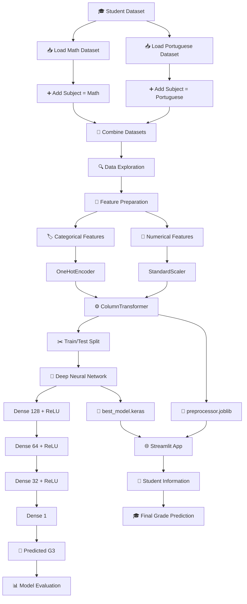
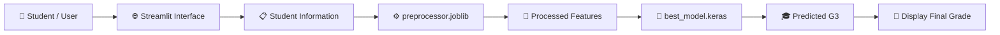

# 🎓 Student Grade Predictor

<p align="center">
  
  
  
  
  
</p>

<p align="center">
  <strong>🧠 A Deep Learning application that predicts a student's final grade based on academic, demographic, social and behavioural attributes.</strong>
</p>

<p align="center">
  
  
  
  
</p>

---

## 📌 Project Overview

**Student Grade Predictor** is a Deep Learning-based regression project designed to predict a student's **final grade (G3)** using information related to their school, family, education, study habits, social activities, health, absences and other student characteristics.

The project combines two datasets:

* 📘 Mathematics students
* 📕 Portuguese students

The datasets are combined into a single dataset and a `subject` feature is added to distinguish between the two subjects.

The trained neural network is then integrated into a **Streamlit web application** for interactive predictions.

---

# 🎯 Objective

The primary objective is to predict:

```text
Final Grade → G3
```

This is treated as a:

```text
Supervised Learning
        ↓
Regression Problem
        ↓
Continuous Numerical Prediction
```

---

# 🧠 System Architecture



---

# 🔄 End-to-End ML Pipeline

```text
🎓 Student Data
      ↓
📥 Dataset Loading
      ↓
🔗 Combine Math + Portuguese
      ↓
🔍 Data Exploration
      ↓
🧹 Feature Preparation
      ↓
🏷️ One-Hot Encoding
      +
⚖️ Standard Scaling
      ↓
✂️ 80/20 Train-Test Split
      ↓
🧠 Deep Neural Network
      ↓
🏋️ Model Training
      ↓
📈 Evaluation
      ↓
💾 Model + Preprocessor
      ↓
🌐 Streamlit Deployment
      ↓
🎯 Final Grade Prediction
```

---

# 📊 Dataset

The project uses the **Student Alcohol Consumption Dataset** downloaded through KaggleHub.

```python
import kagglehub

path = kagglehub.dataset_download(
    "uciml/student-alcohol-consumption"
)
```

The dataset contains two CSV files:

```text
student-mat.csv
student-por.csv
```

These represent students studying:

```text
📘 Mathematics
📕 Portuguese
```

Both datasets are combined into a single DataFrame.

A new feature is added:

```text
subject
```

with values:

```text
math
portuguese
```

---

# 🎯 Target Variable

The final student grade is represented by:

```text
G3
```

The intermediate grades:

```text
G1
G2
```

are excluded from the input features.

This means the model attempts to predict the final grade using the student's other available characteristics.

---

# 🧹 Data Preprocessing

The project separates the features into:

### 🔢 Numerical Features

```text
age
Medu
Fedu
traveltime
studytime
failures
famrel
freetime
goout
Dalc
Walc
health
absences
```

### 🏷️ Categorical Features

```text
school
sex
address
famsize
Pstatus
Mjob
Fjob
reason
guardian
schoolsup
famsup
paid
activities
nursery
higher
internet
romantic
subject
```

---

# 🏷️ Categorical Encoding

Categorical variables are transformed using:

```python
OneHotEncoder(
    handle_unknown='ignore'
)
```

This converts categorical student information into numerical features that can be processed by the neural network.

---

# ⚖️ Numerical Feature Scaling

Numerical features are standardized using:

```python
StandardScaler()
```

The preprocessing pipeline is implemented using:

```python
ColumnTransformer()
```

This allows categorical encoding and numerical scaling to happen consistently.

---

# ✂️ Train/Test Split

The processed dataset is divided into:

```text
80% → Training
20% → Testing
```

using:

```python
train_test_split(
    X_processed,
    y,
    test_size=0.2,
    random_state=42
)
```

The test set is kept unseen during training so that the model can be evaluated on new data.

---

# 🧠 Deep Learning Model

The project uses a fully connected **Artificial Neural Network** built with TensorFlow/Keras.

### Architecture

```text
                    INPUT
                      │
                      ▼
             ┌─────────────────┐
             │ Dense: 128       │
             │ ReLU             │
             └────────┬────────┘
                      │
                      ▼
             ┌─────────────────┐
             │ Dense: 64        │
             │ ReLU             │
             └────────┬────────┘
                      │
                      ▼
             ┌─────────────────┐
             │ Dense: 32        │
             │ ReLU             │
             └────────┬────────┘
                      │
                      ▼
             ┌─────────────────┐
             │ Dense: 1         │
             │ Linear Output    │
             └────────┬────────┘
                      │
                      ▼
                 🎓 G3 Grade
```

---

# ⚙️ Model Configuration

| Parameter         | Configuration             |
| ----------------- | ------------------------- |
| Model             | Sequential Neural Network |
| Task              | Regression                |
| Framework         | TensorFlow / Keras        |
| Hidden Layers     | 3                         |
| Hidden Neurons    | 128 → 64 → 32             |
| Hidden Activation | ReLU                      |
| Output Neurons    | 1                         |
| Output Activation | Linear                    |
| Optimizer         | Adam                      |
| Loss Function     | Mean Squared Error        |
| Metrics           | MAE, MSE                  |
| Maximum Epochs    | 100                       |
| Batch Size        | 32                        |
| Validation Split  | 20%                       |
| Test Split        | 20%                       |
| Random State      | 42                        |

---

# 🏋️ Model Training

The model is trained using:

```python
history = model.fit(
    X_train,
    y_train,
    epochs=100,
    batch_size=32,
    validation_split=0.2,
    callbacks=[
        early_stopping,
        model_checkpoint
    ]
)
```

---

# 🛑 Early Stopping

To reduce unnecessary training, the project uses:

```python
EarlyStopping(
    monitor='val_loss',
    patience=10,
    restore_best_weights=True
)
```

Training stops when the validation loss fails to improve for 10 consecutive epochs.

---

# 💾 Model Checkpoint

The best-performing model is saved using:

```python
ModelCheckpoint(
    'best_model.keras',
    monitor='val_loss',
    save_best_only=True
)
```

This ensures that the best validation performance is preserved.

---

# 📈 Model Evaluation

The model is evaluated using the unseen test dataset.

The project calculates:

### Mean Absolute Error — MAE

```text
Average absolute prediction error
```

### Mean Squared Error — MSE

```text
Average squared prediction error
```

### Root Mean Squared Error — RMSE

```text
√MSE
```

### R² Score

```text
Measures how much variation in G3 is explained by the model.
```

The notebook also compares:

```text
Actual G3
      vs
Predicted G3
```

---

# 📊 Training Visualization

Training and validation performance are visualized using:

### Loss Curve

```text
Training Loss
      vs
Validation Loss
```

### MAE Curve

```text
Training MAE
      vs
Validation MAE
```

Add the generated plots to your repository:

```markdown
<p align="center">
  
</p>
```

---

# 💾 Saved Model Components

The project saves two important components.

### 🧠 Trained Neural Network

```text
best_model.keras
```

### ⚙️ Preprocessing Pipeline

```text
preprocessor.joblib
```

Saving the preprocessing pipeline is important because new Streamlit inputs must go through **the exact same transformations** used during model training.

---

# 🌐 Streamlit Application

The project includes an interactive Streamlit application:

```text
🎓 Student Grade (G3) Prediction
```

Users can enter student information through the sidebar.

The application processes the input and passes it through:

```text
User Input
    ↓
Preprocessor
    ↓
Neural Network
    ↓
Predicted G3
```

---

# 🔄 Prediction Architecture



---

# 🖥️ Application Preview

Add a screenshot of your Streamlit application:

```markdown
<p align="center">
  
</p>
```

---

# 🛠️ Technology Stack

<p align="center">
  
</p>

| Technology      | Purpose                    |
| --------------- | -------------------------- |
| 🐍 Python       | Programming                |
| 🧠 TensorFlow   | Deep Learning              |
| 🔥 Keras        | Neural Network             |
| 📊 Pandas       | Data Processing            |
| 🔢 NumPy        | Numerical Computing        |
| 🤖 Scikit-learn | Preprocessing & Metrics    |
| 🌐 Streamlit    | Web Application            |
| 💾 Joblib       | Preprocessor Serialization |
| 📦 KaggleHub    | Dataset Download           |
| 📈 Matplotlib   | Visualization              |

---

# 📁 Project Structure

```text
📦 Student-Grade-Predictor
│
├── 📓 Student_Alcohol_Consumptio.ipynb
│
├── 🌐 app.py
│
├── 🧠 best_model.keras
│
├── ⚙️ preprocessor.joblib
│
├── 📄 requirements.txt
│
├── 📖 README.md
│
└── 📁 assets
    ├── 🖼️ app-preview.png
    ├── 📈 training-history.png
    └── 🧠 architecture.png
```

---

# 🚀 Installation

Clone the repository:

```bash
git clone https://github.com/YOUR_USERNAME/Student-Grade-Predictor.git
```

Move into the project directory:

```bash
cd Student-Grade-Predictor
```

Install dependencies:

```bash
pip install -r requirements.txt
```

---

# 📦 Requirements

```text
numpy
pandas
scikit-learn
tensorflow
keras
streamlit
joblib
matplotlib
kagglehub
```

---

# ▶️ Run the Application

Start the Streamlit application:

```bash
streamlit run app.py
```

The application will open in your browser.

---

# 💡 Potential Applications

This project demonstrates how Deep Learning can be applied to:

* 🎓 Student performance analysis
* 📊 Academic analytics
* 🔍 Identifying performance patterns
* 📈 Educational data mining
* 🧑‍🏫 Academic support systems
* 🎯 Early student intervention systems

> Predictions should be used as analytical support rather than as the sole basis for academic decisions.

---

# 🔮 Future Improvements

Possible improvements include:

* [ ] Hyperparameter tuning
* [ ] Cross-validation
* [ ] Dropout regularization
* [ ] Batch normalization
* [ ] Feature importance analysis
* [ ] SHAP explainability
* [ ] Compare with Random Forest
* [ ] Compare with XGBoost
* [ ] Student performance dashboard
* [ ] Prediction history
* [ ] Student risk classification
* [ ] Cloud deployment
* [ ] REST API
* [ ] Database integration

---

# ⚠️ Disclaimer

This project is intended for **educational and experimental purposes**.

The predicted grade is a machine learning estimate and should not be treated as an official academic assessment.

---

# 👨‍💻 Author

## Aravind

**AI & Data Science Student | Machine Learning | Deep Learning | Data Science**

<p align="center">
  <strong>Building intelligent solutions with data, mathematics and AI. 🚀</strong>
</p>

---

# ⭐ Support

If you find this project useful:

⭐ Star the repository
🍴 Fork the project
🐛 Report an issue
💡 Suggest an improvement
📢 Share it with others

---

<p align="center">

### 🎓 Student Data → 🧠 Deep Learning → 📊 Prediction

**Built with Python + TensorFlow + Keras + Streamlit 🚀**

</p>
